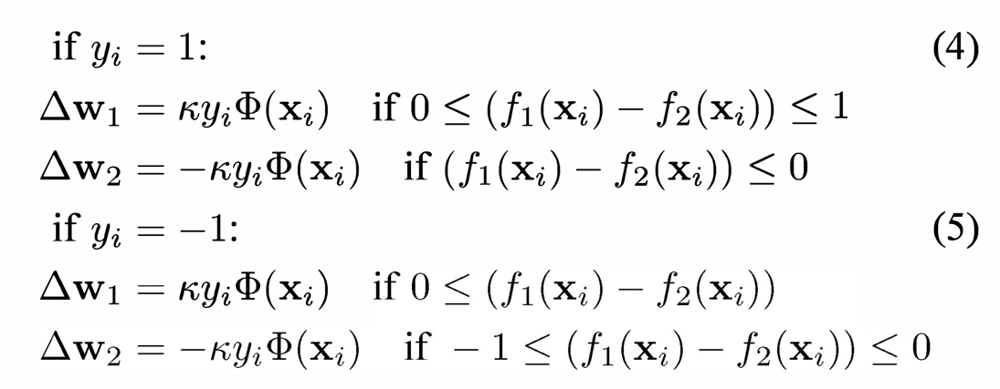

# Comparison of Hebbian and SVM derived classification of MNIST handwritten digits

## Overview

This repository encloses the programmatic part of the research into equivalence of Hebbian learning and the SVN formalism, exploring hypothesis brought forward in [On the equivalence of Hebbian learning and the SVM formalism](https://ieeexplore.ieee.org/document/6310939) [Nowotny, T and Huerta, R]

## Research

### Outset

It is stipulated that it's possible to relate the Support Vector Machine (SVN) formalistm to Hebbian Learning in the context of olfactory learning in the insect brain. This research aims at asessing the validity of this claim by applying them both to the task of handwritten digits classification as a part of an Artificual Neural Network (ANN), using the standardised MNIST dataset.

### Findings

Ultimately, SVM has proven to be markably better than the Hebbian Learning approach reaching consistently higher accuracy, as measured by an F1 score (combination of precision and recall).

### Practical Implementations

This research has it's main practical usefullness within the field of neuromorphic systems, most useful for spiking neural networks (SNNs).

## Impementation

### Approach

The hypothesis, as presented, can be expressed in two systems:

Which essentially means that, apart from the stopping condition represented by the condition `k`, the two models implementation is identical.

The paramaters fed into the model are:

- `k` - learning rate, from 10-6 to 3*10-2
- `i` - number of iterations, from 1 to 5
- `s` - the size of the "hidden" layer of the ANN (100, 300, 1000)

The hypothesis is also tested in two main cases:

- One vs One (`OvO`), where for each class pair (i.e. `3` and `5`) examples crom the balanced set of only those digits are taken and it's decided whether the digit belongs to the first or the second class. This results in 45 (C210) classifiers
- One vs Many (`OvM`), where for there is a classifier for each digit, which decides whether the digit belongs to the class or not. This results in 10 classifiers

### Improvements

Throughout 2017 improvements were introduced to transition the original functional approach to a more object-oriented one, which resulted in a more modular and extensible codebase.

### Tools Used

The models were implemented in Matlab with the code for classes, supporting functions, runner scripts for each of the four comparisons and auxiliary data enclosed.

The Sussex [HPC Appolo Cluster](https://docs.hpc.sussex.ac.uk/apollo2/index.html) was used for calculations, ultimately consuming over 1,000 hours and producing 80 MB of raw data, enclosed int the `/Data` directory.

## Acknowledgements & References

### Funding & Organisational

- [The University of Sussex](https://libcat.wellesley.edu/Record/ebs1041708e) - accomodation and funding within the [IJRA scheme](http://www.sussex.ac.uk/suro/current/ijra)
- [Tomsk State University](https://tsu.ru/) - partial travel funding

### Acknowledgements

- [Prof. Thomas Nowotny](https://profiles.sussex.ac.uk/p206151-thomas-nowotny), Professor Of Informatics (Informatics)
School of Engineering and Informatics - supervision and guidance
- [Dr. Esin Yavuz](https://www.sussex.ac.uk/profiles/320683), postdoctoral fellow working on the Green Brain Project - general research guidance
- [Julie Carr](https://profiles.sussex.ac.uk/p439-julie-carr), Undergraduate Research & PGR Recruitment
Professional Services and JRA Scheme Manager and [Georgie Chesman](https://www.linkedin.com/in/georgie-chesman-84657718a/details/experience/), International Partnerships Officer - heartfelt welcome and organisation

### Academic references

1. Hebb D.O. The Organization of Behavior., 1949
2. Tower D.B. Structural and functional organization of mammalian cerebral cortex; the correlation of neurone density with brain size; cortical neurone density in the fin whale (Balaenoptera physalus L.) with a note on the cortical neurone density in the Indian elephan // J. Comp. Neurol. 1954
3. Cortes C., Vapnik V. Support-vector networks // Mach. Learn. 1995
4. Menzel R., Giurfa M. Cognitive architecture of a mini-brain: the honeybee // Trends Cogn. Sci. 2001
5. Giurfa M. Cognitive neuroethology: dissecting non-elemental learning in a honeybee brain // Curr. Opin. Neurobiol. 2003
6. Huerta R. et al. Learning classification in the olfactory system of insects. // Neural Comput. 2004
7. Nowotny T. et al. Self-organization in the olfactory system: one shot odor recognition in insects. // Biol. Cybern. 2005
8. Huerta R., Nowotny T. Fast and robust learning by reinforcement signals: explorations in the insect brain. // Neural Comput. 2009
9. Gauthier M., Grünewald B. Neurotransmitter Systems in the Honey Bee Brain: Functions in Learning and Memory // Honeybee Neurobiology and Behavior. Dordrecht: Springer Netherlands, 2011
10. Nowotny T., Huerta R. On the equivalence of Hebbian learning and the SVM formalism // 2012 46th Annual Conference on Information Sciences and Systems (CISS). : IEEE, 2012